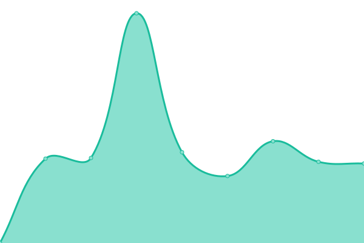
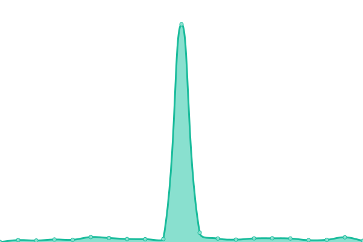
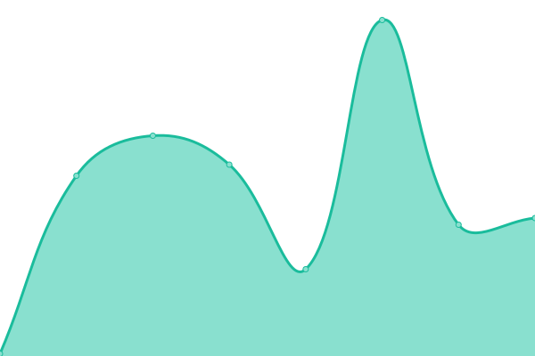

# [📈 Live Status](https://Bassmann.github.io/uptime): <!--live status--> **🟩 All systems operational**

This repository contains the open-source uptime monitor and status page for [Bassmann](mstempl.netlify.app), powered by [Upptime](https://github.com/upptime/upptime).

With [Upptime](https://upptime.js.org), you can get your own unlimited and free uptime monitor and status page, powered entirely by a GitHub repository. We use [Issues](https://github.com/Bassmann/uptime/issues) as incident reports, [Actions](https://github.com/Bassmann/uptime/actions) as uptime monitors, and [Pages](https://Bassmann.github.io/uptime) for the status page.

<!--start: status pages-->
<!-- This summary is generated by Upptime (https://github.com/upptime/upptime) -->
<!-- Do not edit this manually, your changes will be overwritten -->
<!-- prettier-ignore -->
| URL | Status | History | Response Time | Uptime |
| --- | ------ | ------- | ------------- | ------ |
|  [ASO](https://www.asomuenchen.de) | 🟩 Up | [aso.yml](https://github.com/Bassmann/uptime/commits/HEAD/history/aso.yml) | 

 2570ms
     
 | 

<a href="https://Bassmann.github.io/uptime/history/aso">99.77%</a>
    

|  [Netlify](https://mstempl.netlify.app) | 🟩 Up | [netlify.yml](https://github.com/Bassmann/uptime/commits/HEAD/history/netlify.yml) | 

 222ms
     
 | 

<a href="https://Bassmann.github.io/uptime/history/netlify">100.00%</a>
    

|  [Upptime](https://bassmann.github.io/uptime/) | 🟩 Up | [upptime.yml](https://github.com/Bassmann/uptime/commits/HEAD/history/upptime.yml) | 

 117ms
     
 | 

<a href="https://Bassmann.github.io/uptime/history/upptime">100.00%</a>
    

<!--end: status pages-->

[**Visit our status website →**](https://Bassmann.github.io/uptime)

## 📄 License

- Powered by: [Upptime](https://github.com/upptime/upptime)
- Code: [MIT](./LICENSE) © [Bassmann](mstempl.netlify.app)
- Data in the `./history` directory: [Open Database License](https://opendatacommons.org/licenses/odbl/1-0/)
